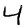
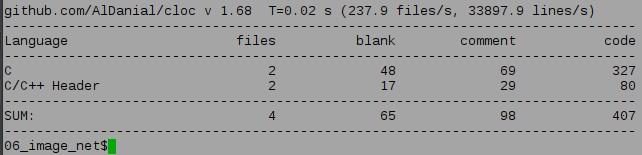

# neural_net_handwriting

A demo project to brush up my machine learning skills by writing an image recognition neural network from scratch in C.

This uses a typical 3-layer multi-layer perceptron.
Training time is about 3 seconds for 80% correct, and 30s for 96% correct
against the competition [MNIST](http://yann.lecun.com/exdb/mnist/) set of
hand-written digits, which is pretty speedy for a simple C program.

* Hand-written linear algebra code in C, refined with asm inspection. Should have somewhat better cache efficiency than numpy etc. for matrix multiplication.
* Hand-written CSV parser for reading the data.
* Hand-written image output for testing the data.

Note that I didn't include the test data files because they are pretty big.
I used the CSV versions which you can download from https://pjreddie.com/projects/mnist-in-csv/.

